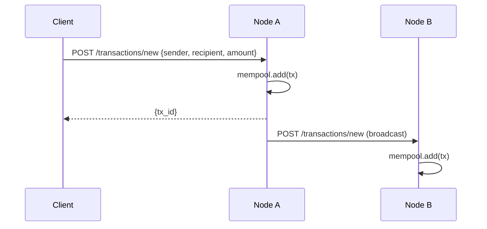
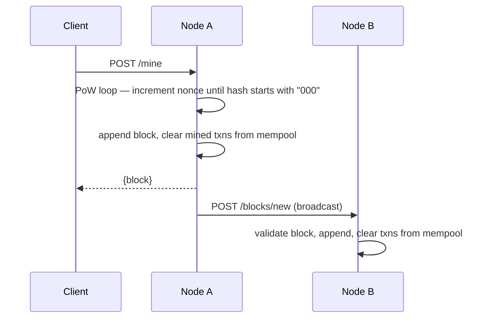
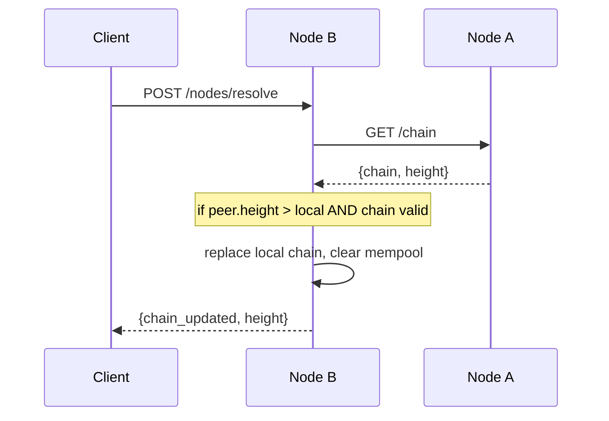

# NovaBlock

A lightweight peer-to-peer blockchain built in Python. Nodes communicate over HTTP REST, share a gossiped transaction mempool, mine blocks via Proof of Work, and reach consensus using the longest-chain rule.

---

## Team

- Brian (Liubri)
- Jason (jgracias05)

---

## Features

- SHA-256 block hashing with tamper detection
- Proof-of-Work mining with configurable difficulty
- Peer-to-peer transaction gossip via mempool broadcast
- Bidirectional peer discovery using seed peers
- Longest-chain consensus for fork resolution
- REST API on every node for full programmatic control
- CLI client and automated integration test suite

---

## Architecture

Each node is an independent Python process. All inter-node communication is HTTP — no shared memory.

```
┌─────────────────────────────────────────────────────────────────┐
│                    node.py  (Flask REST Server)                 │
│  /chain  /mine  /transactions/new  /blocks/new                  │
│  /mempool  /nodes/register  /nodes/resolve  /peers              │
└──────┬──────────────┬────────────────┬──────────────┬───────────┘
       │              │                │              │
 ┌─────▼──────┐ ┌─────▼──────┐ ┌──────▼───────┐ ┌───▼─────────┐
 │blockchain  │ │  mempool   │ │  consensus   │ │   network   │
 │   .py      │ │   .py      │ │    .py       │ │    .py      │
 └─────┬──────┘ └────────────┘ └──────────────┘ └─────────────┘
       │
  ┌────▼────┐
  │ block   │
  │  .py    │
  └─────────┘
```

---

## How It Works

### 1 — Transaction Flow

A client submits a transaction to any node. That node adds it to its mempool and immediately gossips it to all known peers.



### 2 — Mining Flow

A mine request pulls all pending transactions from the mempool, runs the Proof-of-Work loop until the hash meets the difficulty target, then broadcasts the new block to all peers.



### 3 — Consensus Flow

Any node can trigger consensus resolution. It fetches chains from all peers, validates each one, and adopts the longest valid chain. The mempool is cleared on adoption to prevent double-spend.



---

## Quick Start

### Requirements

- Python 3.6+

### Install

```bash
pip install -r requirements.txt --user
```

### Run a Two-Node Network (same machine)

Open three terminals:

```bash
# Terminal 1 — Node 1
python3 node.py --port 5000

# Terminal 2 — Node 2 (auto-discovers Node 1 via seed peer)
python3 node.py --port 5001 --seed-peers http://localhost:5000

# Terminal 3 — Run the integration test suite
python3 test_network.py
```

### Run on the Khoury Linux Cluster (cross-machine)

First get the machine's IP:
```bash
hostname -i   # e.g. 10.1.2.3
```

```bash
# Terminal 1 — Node 1
python3 node.py --port 16000 --advertise-host <your-ip>

# Terminal 2 — Node 2
python3 node.py --port 16001 --advertise-host <your-ip> --seed-peers http://<your-ip>:16000

# Terminal 3 — interact via client
python3 client.py --node http://<your-ip>:16000 submit-tx Jason Brian 50
python3 client.py --node http://<your-ip>:16000 mine
python3 client.py --node http://<your-ip>:16001 resolve
python3 client.py --node http://<your-ip>:16001 get-chain
```

### Run a Three-Node Network (same machine)

```bash
# Terminal 1
python3 node.py --port 5000

# Terminal 2
python3 node.py --port 5001 --seed-peers http://localhost:5000

# Terminal 3
python3 node.py --port 5002 --seed-peers http://localhost:5000 http://localhost:5001
```

### Live Demo (nodes must be running)

```bash
# Submit a transaction to Node 1
python3 client.py --node http://localhost:5000 submit-tx Alice Bob 50

# Mine it on Node 1
python3 client.py --node http://localhost:5000 mine

# Sync Node 2 via consensus
python3 client.py --node http://localhost:5001 resolve

# Verify Node 2 has the block
python3 client.py --node http://localhost:5001 get-chain
```

---

## Client Reference

```bash
python3 client.py --node <url> <command>

Commands:
  submit-tx <sender> <recipient> <amount>   Submit a transaction
  mine                                       Mine pending transactions
  get-chain                                  Print the blockchain
  show-mempool                               Print pending transactions
  show-peers                                 Print known peers
  register-peers <url> [url ...]             Register peer nodes
  resolve                                    Trigger consensus
```

---

## Project Structure

```
NovaBlock/
├── block.py           Block data structure, SHA-256 hashing, validation
├── blockchain.py      Chain management, genesis block, PoW mining loop
├── mempool.py         Pending transaction pool, deduplication, broadcast
├── consensus.py       Longest-chain fork resolution, block broadcast
├── network.py         Peer registry, bidirectional discovery, HTTP helpers
├── node.py            Flask REST server — wires all modules together
├── client.py          CLI tool for interacting with nodes
├── test_network.py    Automated two-node integration test (23 assertions)
└── requirements.txt   Python dependencies
```

---

## Configuration

| Setting | Default | Location |
|---------|---------|----------|
| `DIFFICULTY` | `3` | `blockchain.py` line 5 |
| `NODE_A / NODE_B` | `localhost:5000 / :5001` | `test_network.py` top |